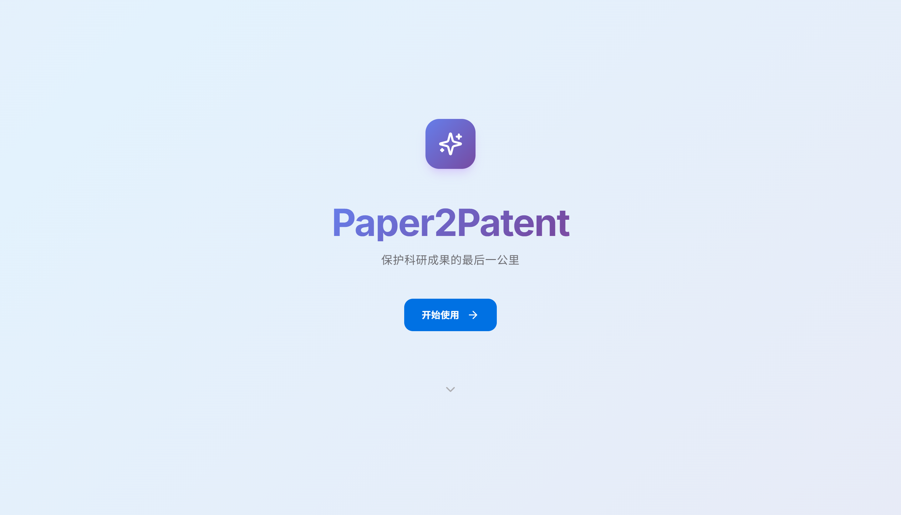
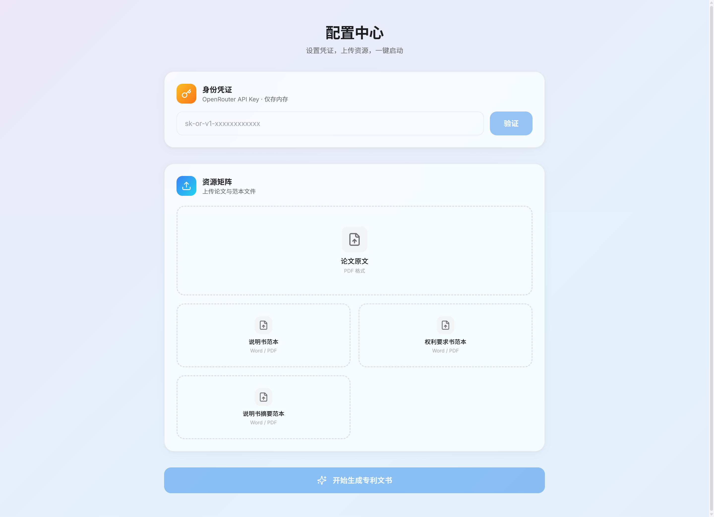

<p align="center">
  
  
  
  
</p>

<h1 align="center">📝 Paper2Patent</h1>
<h3 align="center">保护科研成果的最后一公里</h3>
<p align="center">
  <b>AI 驱动的学术论文 → 专利文书自动生成平台</b><br/>
  一键将学术论文转化为符合 CNIPA 规范的发明专利申请文书
</p>

<p align="center">
  
</p>
<p align="center">
  
</p>

---

## 🌟 项目简介

**Paper2Patent** 是一个端到端的 AI 专利文书自动生成系统。用户只需上传学术论文 PDF 和范本文件，系统即可通过大语言模型（LLM）自动生成完整的发明专利申请文书套件，包括：

- 📄 **说明书**（含技术领域、背景技术、发明内容、具体实施方式等完整章节）
- 📋 **权利要求书**（独立权利要求 + 从属权利要求）
- 📝 **说明书摘要**（300 字以内技术方案摘要）
- 🎨 **专利附图**（AI 自动生成黑白流程图风格的专利附图）
- 📎 **附图提示词**（用于后续手动调整或重新生成附图）

所有文档输出均为 **Word (.docx) 格式**，采用仿宋字体、小四号、固定行距，符合 CNIPA 专利申请排版规范。

### 核心特性

| 特性 | 说明 |
|------|------|
| 🤖 **多模型协同** | Gemini 3 Pro（主力推理） + GPT-5.2（附图提示词） + Gemini 3 Pro Image（附图生成） |
| 📡 **实时流式输出** | SSE 流式传输，实时看到 AI 逐字生成过程 |
| 🖼️ **AI 附图生成** | 自动生成高质量黑白专利流程图（多轮逐张生成） |
| 🎯 **范本驱动** | 基于用户提供的真实专利范本进行模仿学习 |
| 📊 **7 步流水线** | PDF 解析 → 基础构建 → 实施例 → 权利要求 → 摘要 → 附图提示词 → 附图生成 |
| 🍎 **Apple 风格 UI** | 毛玻璃卡片、流动渐变背景、丝滑动效、终端风格日志面板 |
| 📄 **CNIPA 标准输出** | 自动编号 `[0001]`、仿宋字体、固定行距 28 磅 |
| 🔐 **隐私优先** | API Key 仅存内存，不持久化、不上传 |
| ⚡ **秒级 PDF 解析** | PyMuPDF 快速提取（marker-pdf OCR 作为扫描件回退） |

---

## 🏗️ 系统架构

```
┌──────────────────────────────────────────────────────┐
│                   Frontend (Next.js 14)               │
│  Hero → 配置中心 → 生成看板(SSE) → 交付中心           │
│  Tailwind CSS · Framer Motion · Lucide Icons          │
└──────────────┬───────────────────────────────────────┘
               │ REST + SSE
┌──────────────▼───────────────────────────────────────┐
│                   Backend (FastAPI)                    │
│  ┌──────────┐ ┌──────────┐ ┌──────────┐ ┌─────────┐ │
│  │PDF Parser│→│LLM Engine│→│Doc Gen   │→│SSE Push │ │
│  │(PyMuPDF) │ │(OpenRouter)│(python-docx)│(asyncio)│ │
│  └──────────┘ └──────────┘ └──────────┘ └─────────┘ │
│                     │                                 │
│              ┌──────▼──────┐                          │
│              │ Image Gen   │                          │
│              │(Gemini 3 Pro│                          │
│              │  Image)     │                          │
│              └─────────────┘                          │
└──────────────────────────────────────────────────────┘
```

### 技术栈

**后端**
- Python 3.10+ / FastAPI / Uvicorn
- `PyMuPDF` — 秒级 PDF 文本提取（`marker-pdf` 作为 OCR 回退）
- `openai` SDK — OpenRouter API 调用（Gemini 3 Pro / GPT-5.2 / Gemini 3 Pro Image）
- `python-docx` — CNIPA 标准 Word 文档生成
- 异步架构：`asyncio.to_thread()` 处理阻塞操作

**前端**
- Next.js 14 (App Router)
- Tailwind CSS 3.4
- Framer Motion 11（Apple 级动效）
- Lucide React（图标库）

---

## 📦 快速开始

### 前置条件

- **Python 3.10+** 和 **pip**
- **Node.js 18+** 和 **npm**
- **OpenRouter API Key**（获取地址：[openrouter.ai](https://openrouter.ai/)）

### 1. 克隆项目

```bash
git clone https://github.com/Wu-beining/Paper2patent-Generate-patents-based-on-papers-to-be-published.git
cd Paper2patent-Generate-patents-based-on-papers-to-be-published
```

### 2. 启动后端

```bash
cd backend

# 创建并激活虚拟环境
python -m venv venv
# Windows:
.\venv\Scripts\activate
# macOS/Linux:
source venv/bin/activate

# 安装依赖
pip install -r requirements.txt

# 启动服务（开发模式）
uvicorn main:app --reload --port 8000
```

### 3. 启动前端

```bash
cd frontend

# 安装依赖
npm install

# 启动开发服务器
npm run dev
```

### 4. 访问应用

打开浏览器访问 **http://localhost:3000**

---

## 📖 使用说明

### Step 1：进入应用

访问 `http://localhost:3000`，看到 Paper2Patent 的 Hero 落地页，点击"开始使用"进入配置中心。

### Step 2：配置 API Key

在"身份凭证"区域输入您的 OpenRouter API Key，点击"验证"按钮。Key 仅存在服务端内存中，重启即清除。

### Step 3：上传资源

| 文件 | 必填 | 说明 |
|------|------|------|
| 论文原文 | ✅ 必填 | PDF 格式的学术论文 |
| 说明书范本 | 可选 | 已有专利说明书的 Word 文件，用于模仿风格 |
| 权利要求书范本 | 可选 | 已有权利要求书的 Word 文件 |
| 说明书摘要范本 | 可选 | 已有说明书摘要的 Word 文件 |

点击卡片即可选择文件上传。

### Step 4：生成专利文书

点击"开始生成专利文书"按钮，系统进入生成看板，您将看到：

1. **流水线进度**：顶部 7 个节点实时展示各阶段状态（等待 → 处理中 → 完成）
2. **实时终端**：下方终端面板实时流式显示 AI 生成的内容
3. **运行日志**：右下角 Terminal 按钮打开侧边日志面板，实时查看程序执行细节
4. **处理流程**：
   - 📄 PDF 预处理：使用 PyMuPDF 秒级提取论文全文
   - 🏗️ 基础构建：生成专利名称、技术领域、背景技术、发明内容等
   - 📝 实施例撰写：深度展开具体实施方式
   - 📋 权利要求书：生成独立和从属权利要求
   - 📄 说明书摘要：生成 300 字以内摘要
   - 🎨 附图提示词：生成专利附图绘制提示词
   - 🖼️ 附图生成：AI 逐张生成黑白专利流程图

### Step 5：下载文档

生成完毕后进入交付中心，提供：
- **分项下载**：点击每个文档卡片直接下载
- **附图画廊**：轮播浏览生成的专利附图，支持逐张下载
- **一键打包**：点击"一键下载全部"批量下载所有文件

---

## 🔧 端到端测试

项目提供自动化测试脚本 `backend/test_e2e.py`：

```bash
cd backend

# 设置 API Key 环境变量
# Windows PowerShell:
$env:OPENROUTER_API_KEY = "your-api-key-here"
# macOS/Linux:
export OPENROUTER_API_KEY="your-api-key-here"

# 运行测试（需要先在项目根目录放置测试 PDF 和范本文件）
python test_e2e.py
```

测试脚本将自动：配置 API Key → 上传文件 → 监控 SSE 流 → 输出生成结果。

---

## 🛠️ 开发过程说明

### 开发阶段

#### 阶段一：需求分析与架构设计

- **核心需求**：将学术论文 PDF 自动转化为符合 CNIPA 标准的专利申请文书
- **架构决策**：采用前后端分离架构，FastAPI 提供 API 服务，Next.js 提供用户界面
- **模型选型**：选择 OpenRouter 作为 LLM 网关，主力使用 Gemini 3 Pro（推理能力强、长上下文窗口），GPT-5.2 负责附图提示词生成，Gemini 3 Pro Image 生成专利附图
- **流式传输**：采用 SSE（Server-Sent Events）实现实时内容流式推送

#### 阶段二：核心引擎开发

- **PDF 解析器**（`pdf_parser.py`）：使用 PyMuPDF 进行秒级文本提取，marker-pdf 作为扫描件 OCR 回退方案。使用 `asyncio.to_thread()` 避免阻塞事件循环
- **LLM 引擎**（`llm_engine.py`）：封装 6 步 LLM 调用链 + 1 步图像生成，每步使用精心设计的中文 prompt，支持流式输出和动态 API Key 注入
- **文档生成器**（`doc_generator.py`）：基于 `python-docx` 生成标准专利文档，包含仿宋字体、段落编号 `[0001]`、固定行距等 CNIPA 格式要求。内置 `clean_markdown()` 函数自动清洗 LLM 输出中的 Markdown 标记

#### 阶段三：API 与流水线

- **API 路由**（`routes.py`）：实现配置、上传、SSE 流、下载、图片服务五个端点。使用内存字典管理任务状态
- **SSE 心跳保活**：每 10 秒发送心跳消息防止连接超时
- **实时日志推送**：全流程通过 SSE `log` 类型消息推送运行日志
- **附图生成**：解析 GPT 生成的提示词，逐张调用 Gemini 3 Pro Image 生成附图

#### 阶段四：前端交互设计

- **Apple 风格视觉**：毛玻璃卡片（`backdrop-filter: blur(40px)`）、缓慢流动的渐变背景、微动效
- **四段式 SPA**：Hero 落地页 → 配置中心 → 生成看板 → 交付中心，使用 `AnimatePresence` 实现丝滑的阶段切换
- **流水线可视化**：发光弧线连接 7 个节点，支持脉冲呼吸（处理中）和光点飞行动画
- **终端风格面板**：macOS 风格的红黄绿圆点头部、等宽字体、自动滚动、打字光标
- **日志面板**：侧边抽屉式日志面板，颜色编码（步骤=青色、成功=绿色、错误=红色、模型调用=紫色）

#### 阶段五：测试与优化

- **PDF 解析加速**：PyMuPDF 替换 marker-pdf，从 50+ 分钟降至秒级
- **图像生成修复**：发现 OpenRouter 图像数据在 `msg["images"]` 字段（非 `content`），添加 `modalities: ["image", "text"]` 参数
- **提示词优化**：添加 `OUTPUT_CONSTRAINT` 全局约束，禁止 LLM 输出思考过程和 Markdown 标记
- **端到端验证**：使用 `test_e2e.py` 脚本验证完整流程（7 步 + 5 张附图全部通过）

### 关键技术难点及解决方案

| 难点 | 解决方案 |
|------|----------|
| marker PDF OCR 耗时 50+ 分钟 | 替换为 PyMuPDF 秒级提取，marker 作为 OCR 回退 |
| OpenRouter 图像模型返回空 content | 发现图片在 `msg["images"]` 字段，添加 `modalities` 参数 |
| SSE 长连接超时 | 每 10 秒发送 `: heartbeat\n\n` 注释保活 |
| LLM 输出包含 Markdown 格式标记 | 提示词约束 + `clean_markdown()` 双重清洗 |
| Word 文档中文字体不显示 | 设置 `w:eastAsia` 字体属性，回退到仿宋 |

---

## 📁 项目结构

```
Paper2Patent/
├── backend/                    # 后端服务
│   ├── main.py                 # FastAPI 入口
│   ├── api/
│   │   └── routes.py           # API 路由（上传、SSE、下载、图片）
│   ├── services/
│   │   ├── pdf_parser.py       # PDF 解析（PyMuPDF + marker 回退）
│   │   ├── llm_engine.py       # LLM 7 步调用链 + 图像生成
│   │   └── doc_generator.py    # Word 文档生成器
│   ├── requirements.txt        # Python 依赖
│   └── test_e2e.py             # 端到端测试脚本
│
├── frontend/                   # 前端应用
│   ├── app/
│   │   ├── page.tsx            # 主页面（四段式 SPA）
│   │   ├── layout.tsx          # 根布局
│   │   └── globals.css         # Apple 风格设计系统
│   ├── components/
│   │   ├── WorkflowPipeline.tsx # 流水线可视化
│   │   ├── StatusCard.tsx      # 终端风格实时面板
│   │   ├── LogPanel.tsx        # 侧边日志面板
│   │   └── DownloadCenter.tsx  # 交付中心（含附图画廊）
│   └── package.json            # Node 依赖
│
├── Fig1.png                    # 界面截图 - 首页
├── Fig2.png                    # 界面截图 - 生成看板
└── README.md                   # 本文件
```

---

## 📜 License

本项目采用 [MIT License](LICENSE) 开源许可。

---

<p align="center">
  <b>Paper2Patent</b> — 让专利申请不再是科研路上的绊脚石 🚀
</p>
